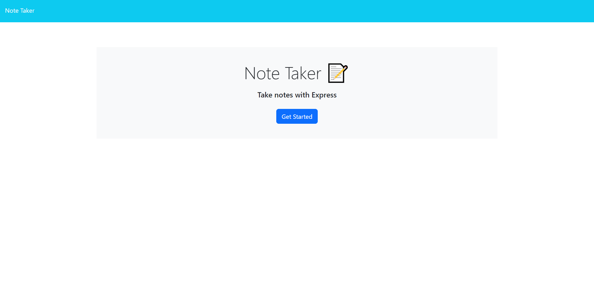

# note-taker

## Description

A note taking app I made using HTML, CSS, Javascript, Node JS, and Express JS

## Installation

N/A

## Usage

Click this link https://m-beke.github.io/note-taker/ to be taken to the application.

From there, click the "Get Started" button to be taken to the note taker. From there, you can enter a new note title and text, then click "Save Note" to save your new note. The note will appear in the left hand column. 

## Credits

MDN Web Docs, Stack Overflow

## License

Please refer to the LICENSE in the repo.